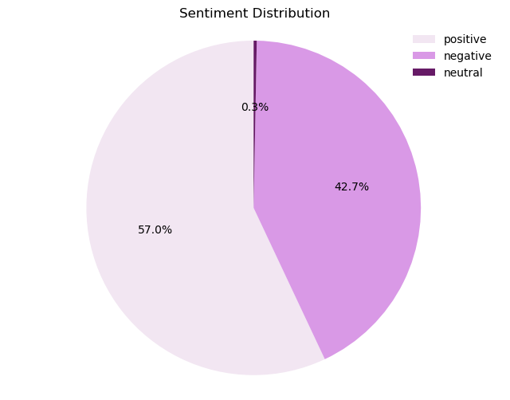

# 🌐 Web Scraping & NLP Analytics for Airline Customer Intelligence  
**Notebook:** `Web scraping to gain company insights.ipynb`  
**Author:** **[Wissam Mosleh](https://github.com/wmosleh)**  
🔗 [GitHub Portfolio](https://github.com/wmosleh)

---

## Overview
This project implements an **end-to-end web scraping and NLP analytics pipeline** to extract, structure, and analyze **airline customer reviews** for business intelligence and decision-support systems.

The system is demonstrated using **1,000 British Airways customer reviews scraped from Skytrax**, transforming unstructured text into **quantitative insights on customer experience, service quality, and operational performance**.

The architecture and methods are directly transferable to:
- ✈️ Airline customer experience monitoring
- 📊 Service quality and brand perception analytics
- 🧠 Operations and delay impact analysis
- 📑 Compliance and reputation tracking systems

---

## 📌 Table of Contents
- [Business Problem](#business-problem)
- [System Architecture](#system-architecture)
- [Pipeline Workflow](#pipeline-workflow)
- [Key Features](#key-features)
- [Results & Visual Insights](#results--visual-insights)
- [Aviation & Enterprise Transferability](#aviation--enterprise-transferability)
- [Tech Stack](#tech-stack)
- [How to Run](#how-to-run)
- [Data & Ethics](#data--ethics)
- [What I’d Improve Next](#what-id-improve-next)
- [Contact](#contact)

---

## Business Problem
Airlines receive large volumes of unstructured customer feedback across multiple platforms. Manual review is:
- Time-consuming
- Subjective
- Difficult to scale

Organizations need **automated, auditable analytics pipelines** that convert raw text into **measurable KPIs and strategic insights** for operations, service quality, and executive decision-making.

---

## System Architecture


**High-Level Flow:**  
Web Scraping → Text Normalization → Feature Engineering → PCA / Topic Modeling → Sentiment Classification → Visualization & Reporting

---

## Pipeline Workflow
**Target URLs → HTTP Requests → HTML Parsing → Text Cleaning & Normalization → Feature Engineering (BoW / PCA) → Sentiment Classification → Topic Modeling (LDA) → Visualization & Reporting**

---

## Key Features
- ✅ Automated scraping of **1,000 airline reviews**
- ✅ HTML parsing and structured field extraction
- ✅ Bag of Words frequency analysis (Top Keywords)
- ✅ **Principal Component Analysis (PCA)** with 2 & 3 components
- ✅ **Sentiment Analysis** (Positive / Neutral / Negative)
- ✅ **LDA Topic Modeling** (3 dominant experience themes)
- ✅ **Word Cloud Visualization**
- ✅ Interactive topic dashboard (`lda_vis.html`)
- ✅ Analytics-ready DataFrames for BI and reporting

---

## Results & Visual Insights

### Sentiment Distribution
<p align="center">
  
</p>

- **57% Positive**
- **42.7% Negative**
- **0.3% Neutral**

---

### Recommendation Rate


- **67.8% did NOT recommend**
- **32.2% recommended**

---

### Word Frequency Analysis


Top recurring terms indicate strong focus on:
- Flight experience and delays
- Staff and service quality
- Cabin and onboard product

---

### Dimensionality Reduction (PCA)


**PC1 — Booking & Time Management**  
`flight, ba, get, hour, tell, would, book, call, day`

**PC2 — Cabin & Service Experience**  
`seat, class, business, good, cabin, food, crew, passenger`

**PC3 — Brand & Customer Service**  
`customer, airline, british, call, crew, flight`

---

### Topic Modeling (LDA)


**Topic 1 — Operations & Boarding**  
`flight, staff, time, delay, gate, boarding`

**Topic 2 — Customer Service & Disruptions**  
`customer, call, cancel, hour, airline`

**Topic 3 — Cabin & Product Experience**  
`seat, class, food, service, crew`

---

### Interactive Visualization
🔗 **[Open LDA Interactive Dashboard](docs/lda_vis.html)**  
Explore topic distributions and term relevance dynamically.

---

## Aviation & Enterprise Transferability
This pipeline directly supports:
- ✈️ Airline customer experience analytics
- 📊 Service quality KPI monitoring
- 🛠️ Disruption and delay impact analysis
- 🧠 Brand and reputation intelligence
- 📑 Executive dashboards and BI systems

---

## Tech Stack
| Category | Tools |
|----------|-------|
| Language | Python |
| Scraping | Requests, BeautifulSoup |
| NLP | NLTK, Scikit-learn |
| Data | Pandas, NumPy |
| Visualization | WordCloud, PyLDAvis |
| Analysis | Jupyter Notebook |

---

## How to Run

### Install Dependencies
```bash
pip install requests beautifulsoup4 pandas numpy nltk scikit-learn wordcloud pyldavis jupyter
